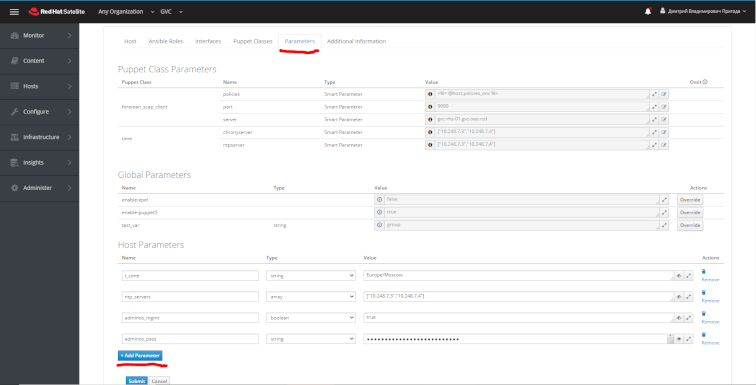

Использование ролей Ansible в RH Satellite/Katello
==================================================
* Для применения роли к хосту, необходимо выбрать хост и отредактировать его свойства `Edit`.

.. figure:: _static/sat-1.PNG
        :scale: 80 %
        :alt: Хост
        :align: center

* Далее на вкладке `Ansible Roles` можно включить или отключить необходимые роли для использования.

.. figure:: _static/sat-2.PNG
        :scale: 80 %
        :alt: Роли
        :align: center
        
* Во вкладке `Parameters` в разделе `Host Parameters` добавляются необходимые переменные.

* Сохранив все значения можно запустить сценарии на исполнение.

.. figure:: _static/sat-4.PNG
        :scale: 80 %
        :alt: Run Ansible
        :align: center
