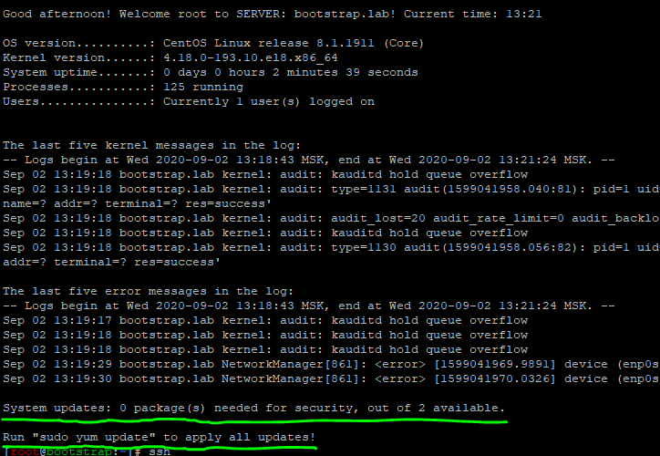
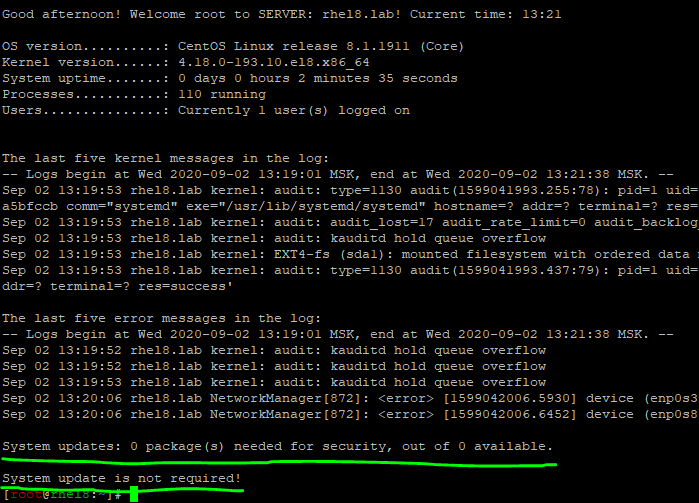

Настройка SSHD на CentOS/RHEL с помощью Ansible
===============================================
Роль для настройки SSH службы. 

При выполнение данного сценария создается новый конфигурационный файл по шаблону, копируется скрипт динамического приветствия `motd`, создается сервис проверки на доступные обновления, изменяется Bash Prompt.

Пример работы скрипта проверки обновления вместе с динамическим приветствием:

        С неустановленными обновлениями.

        С установленными обновлениями.

.. warning:: На RHEL/CentOS 8 ввиду особенностей пакетного менеджера не все доступные обновления отображаются при приветствии.

Дополнительные переменные
~~~~~~~~~~~~~~~~~~~~~~~~~

.. note:: В процессе выполнения сценария генерируется новый конфигурационный файл на основе шаблона. Все переменные относятся к шаблону.

Для данного проекта зарезервированы следующие переменные приведенные в таблице ниже:

.. table:: 

======================= ===========================================================================================================
Var                     INFO
======================= ===========================================================================================================
sshd_use_dns            Определяет будет ли при подключении разрешаться DNS имя клиента. По умолчанию отключен. 
sshd_ports              Задает порт или список для подключения к серверу. По умолчанию 22. 
sshd_listen             Задает сетевой адрес по которому будет доступен сервис. По умолчанию любой. 
sshd_banner             Определяет используемый баннер. По умолчанию отключен. 
login_root              Определяет разрешено ли root'у подключатся по SSH. По умолчанию запрещено. 
gss_auth и gss_cleanup  GSSAPI предоставляет API для различных вариантов аутентификации в системе. По умолчанию отключен. 
sshd_passwd_auth        Включает аутентификацию по паролю. По умолчанию включен. 
sshd_pubkey_auth        Включает аутентификацию по ключу. По умолчанию включен. 
user_accounts           Определяет как и где будут располагаться аутентификационные ключи. По умолчанию в домашнем каталоге. 
sshd_max_sessions       Максимальное количество соединений с одного IP. По умолчанию 5. 
sshd_max_auth           Максимальное количество неудачных аутентификаций. По умолчанию 3. 
sshd_alive_interval     Время простоя клиента в секундах при неактивности до закрытия соединения. По умолчанию 120 сек. 
sshd_alive_count_max    Количество проверок доступности клиента до закрытия соединения. По умолчанию 720. 
sshd_pmotd              При подключение выводит содержимое /etc/motd. По умолчанию отключено. 
sshd_plast              При подключение отображает информацию о последнем успешном входе. По умолчанию включен. 
sshd_tkeep_alive        Включает поддержание соединения активным со стороны сервера. По умолчанию включен. 
sshd_upam               Разрешает запуск сервера под любым пользователем. По умолчанию запрещено. 
sshd_deny_users         Задает список пользователей которым не разрешён вход. По умолчанию ``smenaptk@10.144.*, smenaptk@10.160.*``
======================= ===========================================================================================================

.. attention::  ``'smenaptk@10.144.*'`` и ``'smenaptk@10.160.*'`` запрещают конектиться под учетной записью `smenaptk` из сетей 10.144.0.0/16, 10.160.0.0/16. При переопределение параметра *sshd_deny_users* переменная будет полностью перезаписана.

Теги
~~~~

.. table:: 

=============== ================================================
Tag             INFO
=============== ================================================
sshd_conf       Настраивает конфигурационный файл SSHD.
motd_banner     Создает скрипт динамического приветствия `motd`.
=============== ================================================
